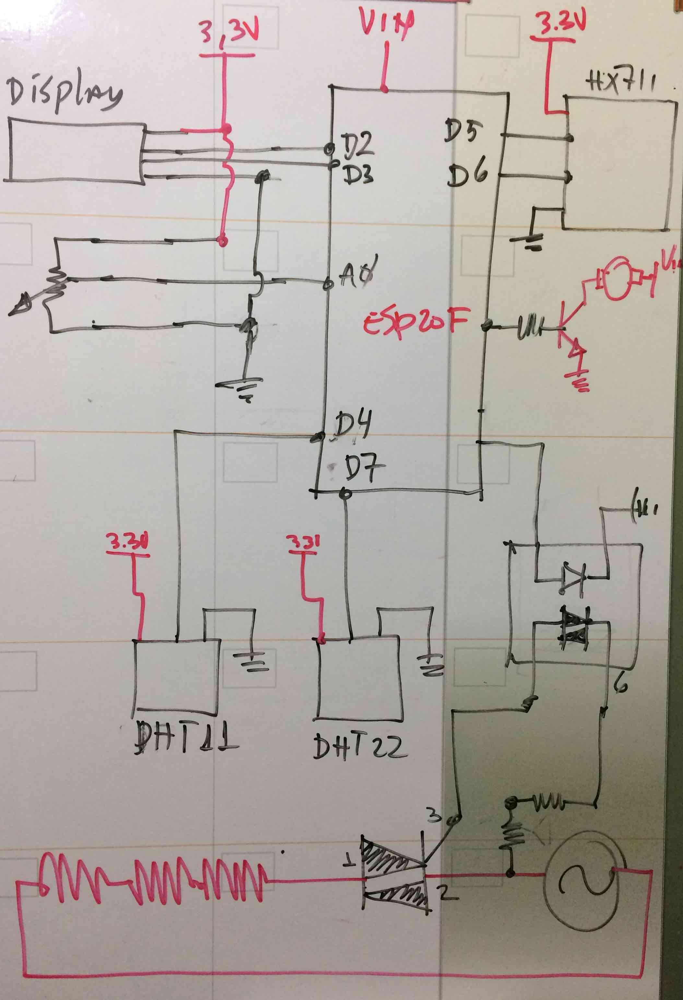

# ESP12_Secador
Projeto de desenvolver um desidratador de laboratorio a partir de um forno elétrico.

Desenvolvido por Rudi van Els [site](http://fga.unb.br/rudi.van) 
 
`/Arduino/ESP12_Secador`

# 1. Apresentação 

Por que fazer este desidratador?

Os requisitos levantado do desidratador são registrar os dados de temperatura, pesos e umidade durante o processe de secagem, permitir o controle preciso de temperatura e vazão de entrada de ar no desidratador e disponibilizar os dados medidos online.

Os dados que serão registrados durante o processo de secagem a cada 10 segundos de forma automática são:

- Temperatura ambiente 
- Umidade relativa do ar no ambiente
- Temperatura no forno
- Temperatura na saída do ar do forno
- Umidade relativa na saída de ar do forno
- Peso do material no forno

Estes dados serão armazenar no próprio secador e vai ser possível accessar estes dados diretamento pela internet em tempo real.

O desidratar vai permitir controlar os seguintes parâmetros do processo de secagem:

- potência aplicado no resistência de aquecimento
- Velocidade do ventilador de entrada do ar

Estes controles devem ser disponibilizados não somente localmente nos botões de operação do desidratodor, mais também por meio de  comandos via internet.

A figura a seguir mostra o diagrama de bloco. 

Num futuro pretende-se que possa-se estabelecer uma taxa de secagem o sistema automaticamente fará a secagem segundo essa taxa.

# 2. Preparação

Este video mostra o forno e a proposta de transformar o forno num desidratador. [link para o video no youtube](https://www.youtube.com/watch?v=agu5u9XPCK0)

# 3. Implementação

O diagrama elétrico é 

## 3.1. Balança eletrônica
Pesagem automática. 

[Video com o protótipo da pesagem automática](https://www.youtube.com/watch?v=mP0JLjlJqJM)

## 3.2. Duto de ar de entrada

[Video com a apresentação do duto de ar de entrada ](https://www.youtube.com/watch?v=D7OGNmsQnvQ)

### Medição de umidade e temperatura no duto de entrada

A foto mostra o medidro de umidade e temperatura DHT11 instalada no duto de entrada do ar.

 

