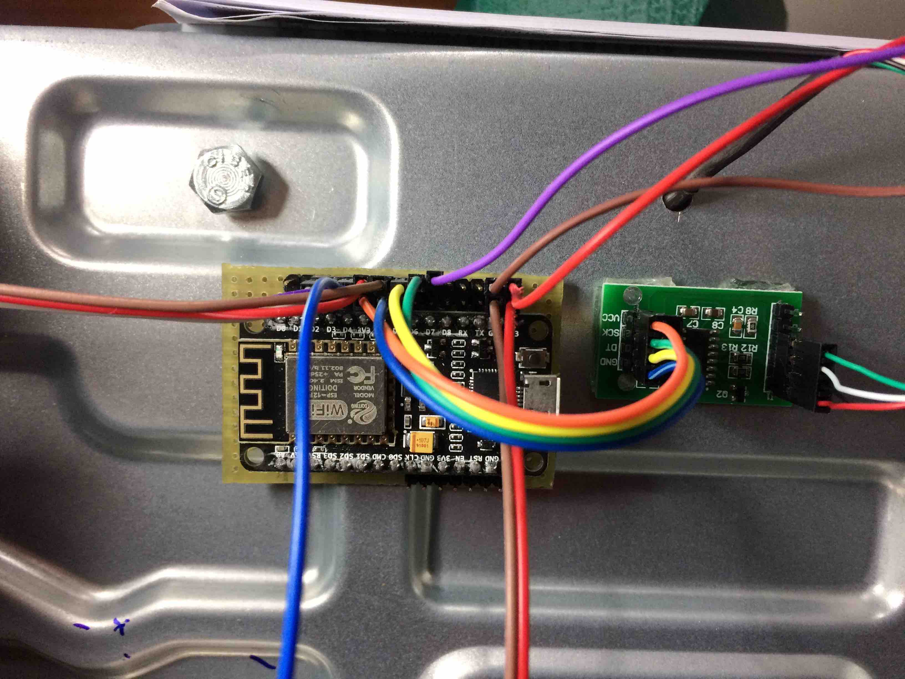

# ESP12_Secador
Projeto de desenvolver um desidratador de laboratorio a partir de um forno elétrico.

Desenvolvido por Rudi van Els [site](http://fga.unb.br/rudi.van) inicio dezembro 2020.
 
`/Arduino/ESP12_Secador`

# 1. Apresentação 

Por que fazer este desidratador?
A demanda surgiu depois de observar o trabalho demorada de levantar curva de secagem de produtos em laboratório onde era necessária  fazer medidas da perda de massa durante horas. 

Um processo típico pode levar algumas horas, com a necessidade de registrar essa perda a intervalos regulares que variam de um a alguns dezenas de minutos. 

Como não tem desidratadores que fazem essas medidas automáticas, resolvi fazer um. Em vez de pegar um desidratador pronto, resolvemos adaptar um forne elétrico, pois os desidratadores comerciais no mercado não são muito apropriados para uso no laboratório por causa do seu tamanho. 

A escolha do usar um forne elétrico é por causa da grande variedades de modelos disponíveis no mercado a preços competitos. Entretanto, nada impede de pegar a tecnologia desenvolvido e adapta-lo a um desidratador comercial.  

Foi escolhido usar um modelo de forno de 36 litros mostrada na figura a seguir.

O desidratador de laboratório deve ser capaz de:
 
- Medir a massa da amostra em tempo real durante o processo de desidratação;
- Medir dados de temperatura e umidade relativo do ar no ambiente e no desidratador;
- Armazenar estes dados no próprio equipamento;
- Controlar a temperatura dentro do desidratador;
- Controlar a vazão da entrada de ar no desidratador;
- Permitir o acesso aos dados por meio da internet;

A figura a seguir mostra a proposta do diagrama de bloco do desidratador. 

Num futuro pretende-se desenvolver um equipamento que possa-se automáticamente fazer a desidratação a partir de uma taxa de secagem  escolhida.

# 2. Preparação

Este video mostra o forno e a proposta de transformar o forno num desidratador. [link para o video no youtube](https://www.youtube.com/watch?v=agu5u9XPCK0)

# 3. Implementação

## 3.1. Adaptação mecânica da parte interna do forno

## 3.2. Câmara de aquecimento 

## 3.3. Balança eletrônica
O video mostra a balança instalada no forno fazendo a pesagem automática. 

[Video com o protótipo da pesagem automática](https://www.youtube.com/watch?v=mP0JLjlJqJM)

A medição da massa é feito por uma célula de carga e um amplificador de instrumentação HX711 mostrada na foto.

## 3.4. Duto de ar de entrada
No lataral do forno foi feita uma adaptação colocando um duto de ar para captar o ar de fora por meio de um ventilador que pode ter sua velocidade controlada.

O video mostra a adaptação e o duto de ar. 
[Video com a apresentação do duto de ar de entrada ](https://www.youtube.com/watch?v=D7OGNmsQnvQ)

### 3.3.1. Medição de umidade e temperatura no duto de entrada

A foto mostra o medidor de umidade e temperatura DHT11 instalada no duto de entrada do ar.

 

# 4. Controle

O circuito de controle tem que ser capaz de medir os variáveis do processo de secagem e ajustar os paramatros do processo.

Os seguintes dados serão registrados de forma automática durante o processo de secagem num intervalo de tempo que pode ser programado:

- Temperatura ambiente 
- Umidade relativa do ar no ambiente
- Temperatura no desidratador
- Temperatura na saída do ar do desidratador
- Umidade relativa na saída de ar do desidratador
- Peso do material no desidratador

Estes dados serão armazenar no próprio secador e vai ser possível accessar estes dados diretamento pela internet em tempo real.

O desidratar vai permitir controlar os seguintes parâmetros do processo de secagem:

- potência aplicado no resistência de aquecimento
- Velocidade do ventilador de entrada do ar

Estes controles devem ser disponibilizados não somente localmente nos botões de operação do desidratodor, mais também por meio de  comandos via internet.

O diagrama elétrico é 

## 4.1. Circuito de acionamento da FAN

## 4.2. Circuito de acionamento da resistência de aquecimento

