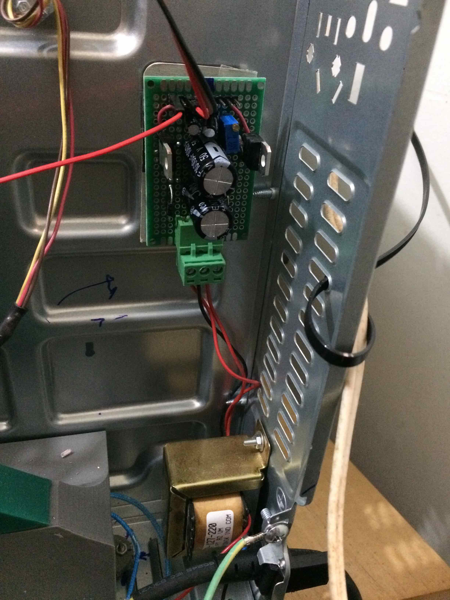
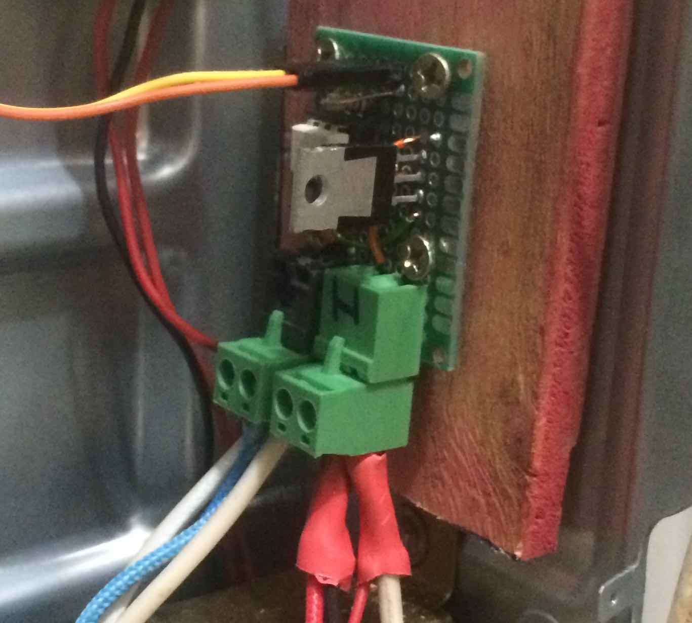

# Desidratador automático de laboratório 

Projeto de desenvolver um desidratador de laboratorio a partir de um forno elétrico.

Desenvolvido por [Rudi van Els](http://fga.unb.br/rudi.van) inicio dezembro 2020.
 
`/Arduino/ESP12_Secador`

`/Arduino?ESP12_Secador/ESP12_Secador_modbus`


# 1. Apresentação 

Por que fazer este desidratador?
A demanda surgiu depois de observar o trabalho demorada de levantar curva de secagem de produtos em laboratório onde era necessária  fazer medidas da perda de massa durante horas ou dias. 

Um processo típico pode levar algumas horas, com a necessidade de registrar essa perda a intervalos regulares que variam de um a alguns dezenas de minutos. 

Como não tem desidratadores que fazem essas medidas automáticas, resolvi fazer um. Em vez de pegar um desidratador pronto, resolvemos adaptar um forne elétrico, pois os desidratadores comerciais no mercado não são muito apropriados para uso no laboratório por causa do seu tamanho. 

A escolha do usar um forne elétrico é por causa da grande variedades de modelos disponíveis no mercado a preços competitos. Entretanto, nada impede de pegar a tecnologia desenvolvido e adapta-lo a um desidratador comercial.  

Foi escolhido usar um modelo de forno de 36 litros mostrada na figura a seguir.


O desidratador de laboratório deve ser capaz de:
 
- Medir a massa da amostra em tempo real durante o processo de desidratação;
- Medir dados de temperatura e umidade relativo do ar no ambiente e no desidratador;
- Armazenar estes dados no próprio equipamento;
- Controlar a temperatura dentro do desidratador;
- Controlar a vazão da entrada de ar no desidratador;
- Permitir o acesso aos dados por meio da internet;


A figura a seguir mostra a proposta do diagrama de bloco do desidratador. 


O desidratador tem uma entrada de ar controlador por um ventilador, uma câmara de aqueciemento com resistores de aquecimento, uma bandeja pendurada numa balança com a amostra a ser desidratada, e uma saída de ar na parte superior. 
O equipamento mede a umidade e temperatura na entrada e saída por meio de uma unidade de controle e mostra os dados num display. 

Num futuro pretende-se desenvolver um equipamento que possa-se automáticamente fazer a desidratação a partir de uma taxa de secagem  escolhida.

# 2. Preparação

Este video mostra o forno e a proposta de transformar o forno num desidratador. [link para o video no youtube](https://www.youtube.com/watch?v=agu5u9XPCK0)


# 3. Implementação

## 3.1. Adaptação mecânica da parte interna do forno

O princípio de funcionamento do desidratador e circular ar na amostra capaz de absorver a umidade.
Para isso o ar do fora do desidratar é aquecida numa câmara de aquecimento para depois circular no desidratador e em seguida extraída para fora.
Assim vamos ter que construir uma entrada de ar controlada no lateral do forno e uma saída, tipo chamine na parte superior do forno.
A entrada de ar deve dar acesso a uma câmara de aquecimento.

 

## 3.2. Câmara de aquecimento 

O forno já tem resistências de aquecimento que podem ser aproveitados. Ao total o forno tem 4 resistores de aquecimento que formam dois circuitos separados com 2 resistores em serie. Cada uma das resistência tem 30 ohms. Assim a potência minima com dois resistores em série (60 ohms) ligado a rede de 220 volts é de 800 Watts.
Com os dois circuitos em paralelo o sistema pode produzir 1600 Watts.
 
Como ainda não se sabe qual a potência necessária para fazer a desidratação vamos começar fazer uma configuração com os quatro resistores em serie, colocando assim inicialmente 400 Watts de capacidade máxima de aquecimento. 

A configuração original do forno tinha um banco de resistores na parte de cima do forno e um banco com dois resistores em baixa. 
A primeira adaptação foi colocar os dois resistores da parte superior na parte de baixo do forno e abrir uma entrada para o ar no lateral, como mostrado na foto a seguir.


Para que o ar seja aquecido de forma uniformente ao no ambiente interno do forno, é necessário construir uma câmara  de aquecimento. 

### 3.2.1 Construção da câmara

## 3.3. Duto de ar de entrada
No lataral do forno foi feita uma adaptação colocando um duto de ar para captar o ar de fora por meio de um ventilador que pode ter sua velocidade controlada.

O video mostra a adaptação e o duto de ar. 
[Video com a apresentação do duto de ar de entrada ](https://www.youtube.com/watch?v=D7OGNmsQnvQ)

A foto a seguir mostra a entrada de ar no lateral do forno, com os 4 resistores de aquecimento lado ao lado.


O duto de ar impresso com impressora 3D foi construido para servir de suporte para a FANe levar o ar externo para dentro do forno. 
A figura a seguir mostra a monagem do conjunto.


Um vez montada o sistema fica como mostrado na próxima foto.


### 3.3.1. Medição de umidade e temperatura no duto de entrada

A foto mostra o medidor de umidade e temperatura DHT11 instalada no duto de entrada do ar.

 

## 3.4. Balança eletrônica

Uma das principais necessidades do desidratador é de poder medir a massa da amostra sem ter que tira-lo do equipamento. 
Para fazer isso foi construído na parte superior do forno um suporte para fixar uma balança eletrônica que por sua vez permite pendurar uma bandeja. 
A estrutura de suporte da bandeja foi construido em aluminio e tem, junto com a bandeja uma massa de aproximadamente xxx gramas.
A foto a seguir mostra o suporte e a bandeja. 


A balança eletrônica tem como elemento central uma célula de carga com capacidade de medir até 1 kg.
Dessa forma pode se colocar amostras de até 500 gramas, que bastante suficiente para uma amostra de secagem. 

A foto em baixo mostra o detalhe da instalação da célula de carga. 


A estrutura montada para suportar a celula de carga e a bandeja a ser pesado é mostrado nas fotografias a seguir.


Detailhe do suporte.


O video a seguir mostra a balança instalada e funcionando no forno fazendo a pesagem automática. 

[Video com o protótipo da pesagem automática](https://www.youtube.com/watch?v=mP0JLjlJqJM)

A célula de carga é ligado a um amplificador de instrumentação HX711 que é processado pelo microcontrolador que comando todo funcionamento do sistema. 


## 3.5. Fonte de alimentação

Foi instalada uma fonte de alimentação para alimentar os novos componentes eletrônicos e o microcontrolador. A fonte fornece o 5 volts cc para a alimentação do microcontrolador e 3.3 Vcc para os demais componentes eletrônicos.
A foto a seguir mostra a fonte instalada no desidratador. 


Entrada 220Vac
Sáida - 5Vcc @ 1 amp. e 3.3 Vcc @ 1 amp.

# 4. Controle

O circuito de controle tem que ser capaz de medir os variáveis do processo de secagem e ajustar os paramatros do processo.

Os seguintes dados serão registrados de forma automática durante o processo de secagem num intervalo de tempo que pode ser programado:

- Temperatura ambiente 
- Umidade relativa do ar no ambiente
- Temperatura no desidratador
- Temperatura na saída do ar do desidratador
- Umidade relativa na saída de ar do desidratador
- Peso do material no desidratador

Estes dados serão armazenar no próprio secador e vai ser possível accessar estes dados diretamento pela internet em tempo real.

O desidratar vai permitir controlar os seguintes parâmetros do processo de secagem:

- potência aplicado no resistência de aquecimento
- Velocidade do ventilador de entrada do ar

Estes controles devem ser disponibilizados não somente localmente nos botões de operação do desidratodor, mais também por meio de  comandos via internet.

O elementos central do controlador é o microcontrolador ESP12F


| Modulos | Descrição |
|:--------|:----------|
| DHT11   | Temperatura e umidade da entrada do ar |
| DHT11   | Temperatura e umidade da saída do ar |
| HX711   | Peso |
| DS18B20 | Temperatura na célula de carga e na câmara|
| Dimmer  | Regular potência de aquecimento |
| FAN     | Ventilador de regula entrad de ar |
| Fonte   | Alimentação de 5v e 3.3v


A interligação do ESP12F com os diversos componentes é mostrada na figura a seguir


Devido as limitações do ESP12 teve que se tirar o LCD e um dos DS18B20, pois nem todos os pinos do ESP podem ser usados como pinos de entrada e saída. 

Os pinos para ligar os módulos sao documentados na tabela a seguir.

| porta | GPIO   |função         | 
|------:|:-------|---------------|
|  D0   | GPIO16 | Chave para habiltar calibração |              
|  D1   | GPIO5  | DS18B20       |
|  D2   | GPIO4  | FAN PWM       |
|  D3   | GPIO0  | DHT 11        |
|  D4   | GPIO2  | DHT 22        |
|  D5   | GPIO14 | HX711 DOUT    |
|  D6   | GPIO12 | HX711 SCK     |
|  D7   | GPIO13 | FAN Rotacao   |
|  D8   | GPIO15 | RES PWM       |
|  A0   |        | potenciômetro |  


Uma proposta de macro esquema elétrico é mostrado no diagrama elétrico a seguir 


## 4.1. Circuito de acionamento da FAN

O circuito de acionamento do ventilador é mostrada a seguir.
O ventilador tem um circuito de realimentação que mede a rotação e disponibilize este dado por meio de um circuito coletar aberto.
  


A foto a seguir mostra a implementação do acionador *driver* de potência do ventilador e as portas USB para sua alimentação. 
 

O sinal de velocidade foi medido no osciloscópio e chega até 100hz quando alimentado com 5 volts. 
Pretende se variar o acionamento por meio de um sinal PWM gerado pelo microcontrolador. 
O PWM do ESP-12F tem uma frequencia de 1kHz e um range de [0-1024] que já vem configurado ao chamar a função `analogWrite(pino , valor);` do Arduino IDE. 

Percebe-se que o ventilador tem uma zona morta que fica em torno de 600 unidades do PWW ou seja 600/1024 * 4,8 volts.

Com controle manual em malha aberta mostra que é possivel com um pouco de sensibilidade ajustar a velocidade até mais ou menos 50Hz.
Valores a baixo disso são difícis de ajustar manualmente em malha aberta.

Isso pode ser um problema, quando queremos ajustar uma vazão de ar de entrada nessa faixa no desidratador.  

Para poder controlador a velocidade da FAN mais precisa e obter baixas vazões de entrada de ar estável no desidratador, vai ser necessária fazer um algoritmo de controle com o usando o sinal de velocidade com realimentação. 

O sinal de velocidade da FAN foi ligado a entrada de interrupção externa no pino D7 do microcontrolador ESP-12F para poder medir a frequencia gerado pela FAN a cada segunda.

Uma tentativa de implementar o controle proporcional simples, tendo como taxa de amostragem 1 segundo com valores de ganho do controlador de variando entre 6 e 15 não deu um resultado muito satisfatório e o sistema ficou instável. 

Isso mostra que vai ser necessário sintonizar um controlador PID. 
O primeiro passo foi fazer um ensaio ao degrau medindo o tempo entre cada interrupção gerado pelo sensor de velocidade da FAN e armazenando o tempo numa vetor de 200 pontos.  

O programa no Arduino que armazena os dados medidos e mandar para o Octave e mostado a seguir.

```
void ICACHE_RAM_ATTR handleInterrupt() 
{
 interruptCounter++;
 if (start==1)
 {
  temp_millis_ant=temp_millis;  
  temp_millis=millis();
  delta_millis=int(temp_millis-temp_millis_ant);
  medidas[i]=delta_millis;
  i++;
  if (i>=tam) start=0;
  }
}

void setup() 
{
 pinMode(PWM_FAN, OUTPUT);
 pinMode(SENS_ROT, INPUT_PULLUP);
 pinMode(D8, OUTPUT);
 digitalWrite(PWM_FAN, 0); 
 Serial.begin(115200);
 delay(1000);
 attachInterrupt(digitalPinToInterrupt(SENS_ROT), handleInterrupt, FALLING);
 Serial.println("Pronto  ");
}

unsigned long previousMillis = 0;
int ledState = LOW;
int erro =0;
int saida =0;
int inByte;

void loop() 
{
 digitalWrite(PWM_FAN, 0); 
 Serial.flush();
 delay(1000);
 while (Serial.available()==0);
 inByte = Serial.read();
 temp_millis=millis();
 start=1;
 digitalWrite(PWM_FAN, 1); 
 i=0;
 delay(5000);
 for (i=0;i<tam;i++)
 {
  Serial.println(medidas[i]);
 }
 Serial.flush(); 
 delay(1000); 
} 
```


O programa em Octave que leu, tratou e plotar essas medidas do Arduino de forma automática está listado a seguir.

```
# Programa /Users/rudi/src/octave/secador/testa1.m
# o programa espera os dados do Arduino com os 
# 200 primeiras interrupcoes e os respectivos tempos em cada 
# interrupçao para plotar o grafico

pkg load instrument-control

s1 = serial("/dev/tty.SLAB_USBtoUART");
pause(1);
srl_flush(s1);
srl_write(s1,"1");
data=char(srl_read(s1,260));  # 200
cc=textscan(data,"%f");
fclose(s1);
lin=transpose(cc{:}) * 0.001;  # valores em millisegundos
tam=length(lin);
t=[1:tam];
x=lin;
vel=lin;
x(1)=lin(1);
for i=1:(tam-1)  x(i+1)=x(i)+lin(i+1); endfor
for i=1:(tam)    vel(i)=1/lin(i);      endfor 
plot(x,vel,x,vel,"*")
title("Resposta ao degrau");
xlabel("tempo em segundos");
ylabel("frequencia em Hz");
```


O resultado desse ensaio é mostrada na figura a seguir, 


Eixo x = Tempo em milisegundos ; 
Eixo y = Frequencia.


A proposta agora é projetar um controlador para poder garantir uma velocidade e consequentemente uma vazão controlada no desidratador. 

O desafio vai ser montar uma estratégia de controle pendurada na interupção do próprio sensor e usar como referência o tempo entre cada interupção, ou sintonizar um controlador PID com taxa de amostragem de 1 segundo capaz de garantir o controle. 


Analisando a constante de tempo de 400 ms do ventilador, surge a pergunta. É possivel calcular um controlador digital proporcional capaz de ter uma resposta estável para um sistema de primeia ordem do tipo 1 com taxa de amostragem de 1 segundo ?

Será que pode ser mostrado teoricamente que para estes casos se precisa de um controlador que lembro das amostras anteriores, como por exemplo PI e PD?

Como o foco deste texto não entrar na teoria de controle, vamos disponibilizar um outro repositório para explicar essa questão, mostrando o passo a passo da sintonia, usando o hardware disponível e as ferramentas de análise e sintonia de controladores do Octave.
O resultado dessa pesquisa será incorporado no controle de velociade do desidratador.  

## 4.2. Circuito de acionamento da resistência de aquecimento

Outra parte crucial no desidratador é a capacidade de controlar a temperatura na camara de aquecimento e consequentemente a temperatura do ar que entre no desidratador.

Para isso vai ser necessária controlar a potência dissipada nos resistores de aquecimento usando o princípio de um Dimmer. Só que neste caso o Dimmer será diretamente controlado pelo microcontrolador a partir da leitura das variáveis de temperatura, humidade do ar e velocidade do ar de entrada.

O circuito que permite o acionamento das resistências de aquecimento é mostrado a seguir.  


Datasheet do triac.


É um circuito clássico de chave eletrônico por meio de um Triac (BT137 ou TIC226) acionado por um opto acoplador de isolamento MOC3023. O diode emissor de luz (led) dentro do MOC3023 é que aciona o circuito de potência. A vantagem dessa abordagem é que pode-se ligar diretamente o led à uma porta do microcontrolador e usar a mesma estratégia de variar a potência por meio da técnica PWM usado para acionar o circuito de velocidade. 

Entretanto, como a resistência é acionado por uma fonte de potência AC da rede elétrica comercial que tem uma frequencia de 60Hz, vamos implementar a frequencia de chaveamento do PWM a uma frequencia muito mais lento que frequencia da rede elétrica. Isso é divido a própria característica do Triac e também pela limitação de tempo de chaveamento do led. 

Como se trata de um processo térmico onde a constante de tempo é muito lento, na ordem de dezenas de segundos, podemos escolher qualquer frequencia pelo menos dez vezes menor que a frequencia da rede. 

Se o aquecimento fosse feito com lâmpadas incandescente, seria intessante usar uma outrá técnica de acionamento que evitasse a efeito visual da variação da luz. Neste caso poderia se optar por circuitos de acionamento mais sofisticado que modulam a largura do pulso da própria tensão da rede. 

Como nosso circuito é resistivo, podemos usar essa estratégia mais simples. Outra questão que tem que depois ser avaliado é a interferência que o circuito de chaveamento de potência pode causar nos circuitos de medição de temperatura, humidade, célula de carga e a velocidade da FAN. 

Mas isto será avaliada experimentalmente. 

A foto mostra o circuito montado.



O circcuito foi testado e a frequencia de chaveamento que melhor funcionou foi de 6 Hz. 
A única inconveniente é que em todas as frequencias testadas a lampada incandescente piloto fica piscando.
Para resolver isso deveria-se sincronizar a modulação de largura de pulos com a frequencia da rede elétrica, mas isso leva a uma carga excessiva de programação. 

O jeito simples é retirar a lampada piloto.
 

## 4.3. Algoritmo de controle de temperatura


Para implementar o algoritmode controle de controle de temperatura precisamos identificar o modelo dinâmica do sistemas.

O primeiro passo é fazer um enasio a uma entrada degrau e medir o comportamento da temperatura. 

O ensaio será realizado nas condições normais de operação do desidratador, com o ventilador ligada em 600 de 1023 unidades, a potencia da resistência também ligada em 600 
de 1023 unidades, e a saída de ar aberta.

Ao ligar o desidratador nessas condições em malha aberta colocando a potencia da resistência de aquecimento em 600 de 1023 unidades, a temperatura no forno chegou a 80 graus celcius em aproximadamente 20 minutos e continua aumentando. 
O relatório do ScadaBR mostra a seguinte figura.


Como a temperatura chegou além do ponto de operação do desidratador, vamos mudar o ensaio e colocar um degrau de malha aberta de 300 de 1023 unidades.

Além disso, vamos colocar um peso inerte de 321 gramas para também avaliar o comportamento da célula de carga em função da temperatura.

### 4.3.1. Ensaio a degrau

```
# Programa /Users/rudi/Desktop/ensaio_controle_temp/ensaio1.m
# o programa espera os dados do relatorios do ScadaBR para plotar o grafico
# entrada degrau 300/1023 unidades  saida graus

pkg load io
X = csv2cell('temp.csv',',');
#
#  [1,1] = secador - Temperatura3
#  [1,2] = 2021/01/31 22:50:39
#  [1,3] =  28

X(:,2);
t=datenum(X(:,2),"yyyy/mm/dd HH:MM:SS");
tempo=t;
temperatura=t;
tempo(1)=0;
for i=2:length(t)
    tempo(i)=(t(i)-t(1))*24*60*60;
endfor    

tp=X(:,3);
for i=1:length(t)
   temperatura(i)=tp{i,1};
endfor

plot(tempo,temperatura,tempo,temperatura,'*');
grid
title("Resposta ao degrau Entrada 300/1023 PWM");
xlabel("tempo em segundos");
ylabel("temperatura em graus");
```


Com este ensaio é possível parametrizar o modelo. 

### 4.3.2 Modelo de sistema de primeira ordem

Y(s) / U(s) = K / ( t s +1) 

onde K é o ganho e t o constante de tempo.
Considerando o valor final da curva de temperatura em 85 graus para um degrau de 300 de 1023 unidades.

O ganho noss caso será  K = ( 85 - 27 )/ 300

O constante de tempo t é o tempo que a curva atinge 63% do valor final. 
Ou seja 62,3% do valor final é 53 graus celcius e este valor é atingido no instante de 658 segundos. 

Y(s) / U(s) = 0,1933 / (658 s +1 )

```
# Simulacao do modelo tomando como valor inicial 27 graus celcius
# e uma entrada degrau de 300 unidades
num = (85-27)/300;
den = [658 1];
t=(0 :1 :2500);
sys = tf (num , den);
[y , t, x ]=step(sys, t);
plot(t,y*300+27)

```
A figura mostra o modelo simulado e a resposta real.
Dá para ver claramente a necessidade de incorporar o atraso de tempo do sistema.

Entretanto creio que com um controlador PI será possível regular a temperatura.  


### 4.3.3 Controlador PID 

D(s) = Kp ( 1 + 1 / Ti s + Td s )

Vamos usar o método clássico de sintonia do controlador de PID, método de resposta ao degrau ou primeiro método de Ziegler Nichols.
O método usa o atraso de tempo "L" e a constante de tempo "T" e a taxa de reação que é R = A / T


L = 150 e  T = 1200 segundos e R = A /T  = (85-27)/1200 = 0,048;   RL = 0,048 * 150 = 7,25
1/ RL = 0,138


| Tipo | Kp       |  Ti     | Td    | 
|-----:|:--------:|:-------:|:-----:|
| P    |   1 / RL | inf     | 0     |
| PI   | 0,9 / RL | L / 0,3 | 0     |
| PID  | 1,2 / RL | 2 L     | 0,5 L |


| Tipo | Kp    | Ti  | Td | 
|-----:|:-----:|:---:|:--:|
| P    | 0,138 | inf | 0  |
| PI   | 0,124 | 500 | 0  |
| PID  | 0,166 | 300 | 75 |


Simulação do controlador e do processo.

```
num = (85-27)/300;
den = [658 1];
t=(0 :1 :2500);
sys = tf (num , den);
#[y , t, x ]=step(sys, t);
#plot(t,y*300+27)

# controlador PID
contr = pid(9.6, 300, 75);
# Sistema em malha aberta
sist_abert = blkdiag(sys, contr);
# Sistema em malha fechada
sist_fech  = feedback(sist_abert);
# Simulação da entrada a degrau
step(sist_fech,t);
#plot(t,y*300+27)

```


### 4.3.4  Implementação do controlador  digital

O controlador proportional integral derivativa tem a seguinte implementação:

```
U(s) / E(s) = Kp ( 1 + 1/ Ti s + Td s)
```

Para implementar o controlador pelo seu equivalente discretizado vamos utilizar o método da aproximação retangular para o integrador e o método da aproximação retangular regressiva para o controlador derivativa.
 
Para o termo integrativo substituimos  s por  (z-1)/T 

Para o termo derivativo substituimos  s por  (z-1)/ Tz  

O tempo e amostragem T  é de 1 segundo  

  
Resolvendo o sistema e tomanda a transformada inversa chega se ao seguinte algoritmo de controle 

```
U(t) = U(t-1) + q0 E(t) + q1 E(t-1) + q0 E(t-2)

onde q0 = Kp (1 + Td) = 0.125   =  49,96
     q1 = Kp (-1 + 1/Td - 2Td ) = -99,76
     q2 = Kp * Td               =  49,80

```


ou sua implementação no arduino fazendo U=Saida e E é sinal de erro.
Uma problema que apareceu é a saturação do termo integral *intregral windup* que foi retirado por meio de uma sentença *if else*

```
void interrupcao_1segundo(void)
{
 Saida_1 = Saida;
 Erro_2 = Erro_1;
 Erro_1 = Erro;
 Erro = Referencia - Temperatura; 
 Saida = Saida_1 + q0 * Erro +  q1 * Erro_1 + q2 * Erro_2;
 if (Saida > 1023) {analogWrite(PWM_RES,1023); Saida=1023;}
  else
   if (Saida => 0) analogWrite(PWM_RES, Saida); 
    else { analogWrite(PWM_RES, 0); Saida=0;}
}
```


O controlador PID sintonizado por este meio não funciou de acordo conforme pode ser visto nas fuguras.
O setpoint nessa condição era de 

 
 


Fizemos alguns ajustes dos parametros por tentativa e erro, mas mesmo assim o sistema ficou oscilando muito. 

Vamos ter que partir para outra estratégia de controle, usando os métodos classicos de alocação de polos ou um feedforward so 

## 4.4. Algoritmo de compensação de temperatura da balança 

Um desafio deste projeto é de fazer a compensação da medição de massa com o aumento da temperatura, já que o ensaio vai ser realizado com temperatura bem a cima de temperatura ambiente para qual o sensor é calibrado.   

A especificação técnica da célula de carga o sensor deve aguantar temperaturas até 70 graus, mas deve ter uma distorção da medição com o aumento da temperatura. 

Um ensaio num outro projeto [1] com uma celulá de carga com a mesma caracterítica levantou o comportamento da mesma em relação aumento de temperatura. A figua a seguir mostra que uma amostra inerte de massa conhecido submetido a um ensaio. 

  

Chega se a conclusão que tem para um aumento de 30  graus celsius tem-se um aumento de aproximadamente 10 gramas no valor inicial de 95 gramas.
Isso dá um aumento de 0,35% por incremento de grau celcius.

Convem mencionar que este foi o primeiro ensaio e que são necessários mais ensaios para fazer uma calibração mais precisa.
Também é necessário modelar o retardo ou atraso do processo e avaliar sem tem algum efeito de histerese.

[1] Santos I da S, Mendonça ARV, Els RH van. Instrumentacão de secador de bandejas. Congr. iniciação científica Univ. Brasília, 2020.

### 4.4.1. Compensação dinâmica 


Para a compensação da leitura da massa com a célula de carga é necessário fazer a compensação do efeito da temperatura na célula. 
Para isso, foi colocado um sensor de temperatura colado na célula de carga conforme mostrado na figura a baixo.


Também devemos estudar ainda o comportamento da temperatura no ambiente do desidratador e a temperatura nas partes metálicos da parede do forno. 
A célula de carga está fixado a uma barra de alumínio que por sua vez está ligado a parede do forno. Isso pode influenciar no comportamento térmico. 
Uma alternativa que se pode avaliar no futuro é de usar uma chapa não metálica e bom isolante térmica para fixar a célula de carga, assim isola-lo.

Também percebeu-se o atraso entre a inflencia da temperatura na deformação do metal.

Vamos aqui fazer uma série de ensaios para identificar o modelo da celula de carga em função da temperatura e fazer a compensação dinâmica da massa.   


# 5. Resultados

# 5.1. Teste com majericao


# 5.1. Teste com banana


Curva de secagem ensaio com banana.


